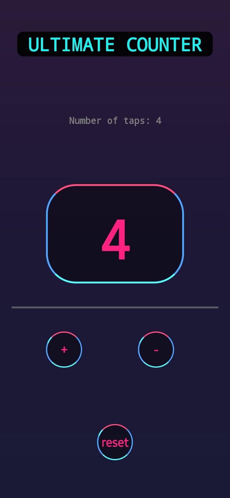
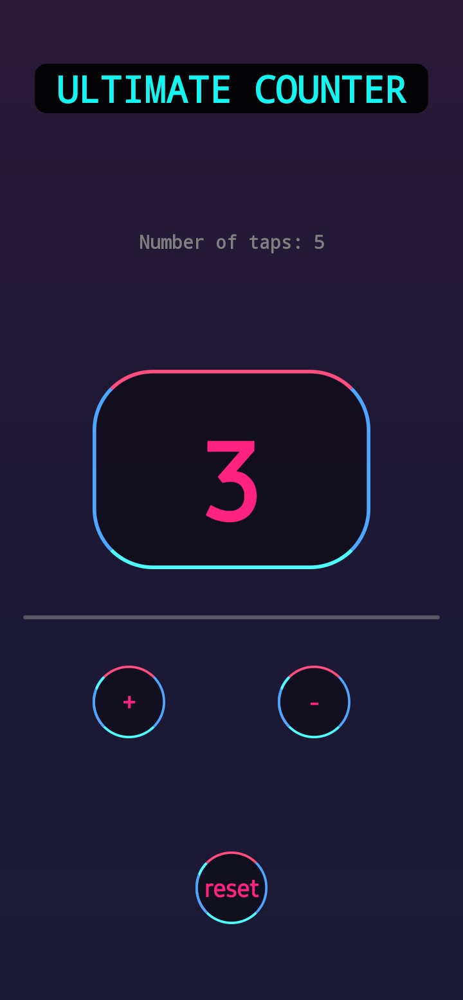
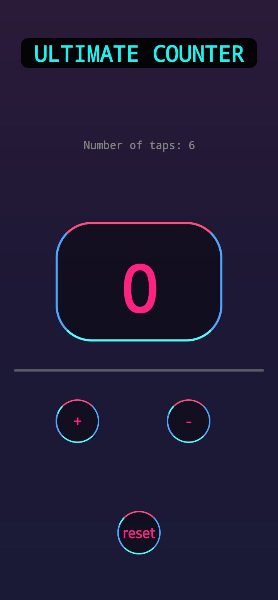
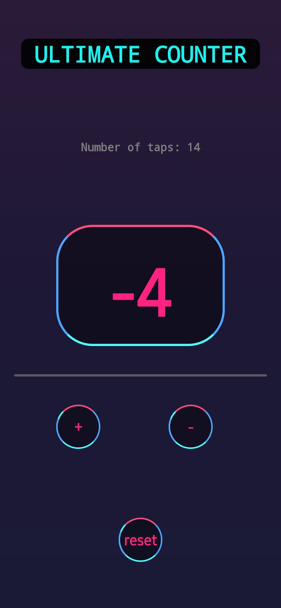

# The Ultimate React Native Counter App

This is a neon themed counter application made using React native, inspired by [THIS](https://dribbble.com/shots/16138432-Banking-App-Mobile-Design-Concept) dribble design.

## Working
Guess what the app does? Yeah, it counts numbers,taps and you can reset the number back to 0,that's just about it.

## Images 

Here are few images that'll show you how it looks.

The first image shows how the app looks initially, the 2nd,3rd and 4th images show the result after 4 '+' taps, 1 '-' tap and the reset respectively. The last image shows the negative numbers. 

## Author

[Siddharth Pradeep](https://github.com/thirt33n)
